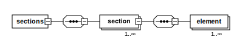

# Section structure

A `<section>` is a reusable part of a [`<page>`](../page.md) and is the standard file for defining UI elements on a page used in a test.

A `<section>` can define:

-  An explicit element that has a selector equal to the constant string. Example: `selector="#add_root_category_button"`
-  A parameterized element that contains substitutable values in the selector. Example: `selector="#element .{{var1}} .{{var2}}"`.

## Substitutable values

Substitutable values in the test can be of the following formats:

-  String literals (`stringLiteral`)
-  References to a [data entity][] (XML data from the corresponding `.../Data/*.xml`) such as `entityName.Field`.
-  Persisted data:
   -  `$persistedCreateDataKey.field$` for data created in the scope of a [test][] using the [`<createData>`][] action with `stepKey="persistedCreateDataKey"`.
   -  `$$persistedCreateDataKey.field$$` for data created in [before][] and [after][] hooks. Even though `<before>`and `<after>` are nested inside a [test][], persisted data is stored differently when it is done in a test hook. Therefore it must be accessed with a different notation.

The following diagram shows the XML structure of a Functional Testing Framework section:



## Format

The format of a `<section>` is:

```xml
<?xml version="1.0" encoding="UTF-8"?>

<sections xmlns:xsi="http://www.w3.org/2001/XMLSchema-instance"
      xsi:noNamespaceSchemaLocation="urn:magento:mftf:Page/etc/SectionObject.xsd">
   <section name="">
      <element name="" type="" selector="" />
      <element name="" type="" selector="" parameterized="true"/>
      <element name="" type="" selector="" timeout=""/>
   </section>
</sections>
```

## Principles

The following conventions apply to Functional Testing Framework sections:

-  `<section>` name must be alphanumeric.
-  `*Section.xml` is stored in the _Section_ directory of a module.
-  The name format is `{Admin|Storefront}{SectionDescription}Section.xml`.
-  Camel case is used for `<section>` elements.
-  One `<section>` tag is allowed per section XML file.

## Example

Example (`.../Catalog/Section/AdminCategorySidebarActionSection.xml` file):

```xml
<?xml version="1.0" encoding="utf-8"?>

<sections xmlns:xsi="http://www.w3.org/2001/XMLSchema-instance"
        xsi:noNamespaceSchemaLocation="urn:magento:mftf:Page/etc/SectionObject.xsd">
    <section name="AdminCategorySidebarActionSection">
        <element name="AddRootCategoryButton" type="button" selector="#add_root_category_button" timeout="30"/>
        <element name="AddSubcategoryButton" type="button" selector="#add_subcategory_button" timeout="30"/>
    </section>
</sections>
```

This example uses a `AdminCategorySidebarActionSection` section. All sections with same name will be merged during test generation.

The `AdminCategorySidebarActionSection` section declares two buttons:

-  `AddRootCategoryButton` - button with a `#add_root_category_button` locator on the parent web page
-  `AddSubcategoryButton` - button with a `#add_subcategory_button` locator on the parent web page

The following is an example of a call in test:

```xml
<!-- Click on the button with locator "#add_subcategory_button" on the web page-->
<click selector="{{AdminCategorySidebarActionSection.AddSubcategoryButton}}" stepKey="clickOnAddSubCategory"/>
```

## Elements reference

### section

`<section>` contains the sequence of UI elements in a section of a [page][].

Attributes|Type|Use|Description
---|---|---|---
`name`|string|required|Unique section name identifier.
`deprecated`|string|optional|Used to warn about the future deprecation of the section. String will appear in Allure reports and console output at runtime.
`remove`|boolean|optional|The default is `false`. Set to `true` to remove this element during parsing.

### element

`<element>`is a UI element used in an [action][].

Attributes|Type|Use|Description
---|---|---|---
`name`|string|required|The element name; Must be alphanumeric.
`type`|string|required|The type of the element. Possible values: `text`, `textarea`, `input`, `button`, `checkbox`, `radio`, `checkboxset`, `radioset`, `date`, `file`, `select`, `multiselect`, `wysiwyg`, `iframe`, `block`.
`selector`|string|optional|[XPath][] or [CSS][] selector of the element.
`locatorFunction`|string|optional|[Locator function][] declaration to be used in lieu of a selector.
`timeout`|string|optional|The timeout after interaction with the element (in seconds). The default is _none_.
`parameterized`|boolean|optional|Include and set to `true` if the `selector` for this element has parameters that need to be replaced for proper use. Learn more in [Parameterized selectors][].
`deprecated`|string|optional|Used to warn about the future deprecation of the element. String will appear in Allure reports and console output at runtime.
`remove`|boolean|optional|The default is `false`. Set to `true` to remove this element during parsing.

#### `timeout` attribute

The attribute adds the [waitForPageLoad] action after a reference to the element in test.
The most usual use case is a test step with a button click action.

**Use case**: Set a timeout of 30 seconds after clicking the `signIn` button.

The section element code declaration containing the timeout attribute:

> StorefrontCustomerSignInPopupFormSection.xml

```xml
...
<element name="signIn" type="button" selector="#send2" timeout="30"/>
...
```

The test step that covers the use case:

> CaptchaWithDisabledGuestCheckoutTest.xml

```xml
...
<click selector="{{StorefrontCustomerSignInPopupFormSection.signIn}}" stepKey="clickSignIn"/>
...
```

Whenever the `signIn` button is used in a test, the Functional Testing Framework will add a 30 second `waitForPageLoad` action immediately after the `click`.

[waitForPageLoad]: ../test/actions.md#waitforpageload
[data entity]: ../data.md
[test]: ../test/index.md#test
[`<createData>`]: ../test/actions.md#createdata
[before]: ../test/index.md#before
[after]: ../test/index.md#after
[page]: ../page.md
[action]: ../test/actions.md
[XPath]: https://www.w3schools.com/xml/xpath_nodes.asp
[CSS]: https://www.w3schools.com/cssref/css_selectors.php
[Locator function]: locator-functions.md
[Parameterized selectors]: parameterized-selectors.md
