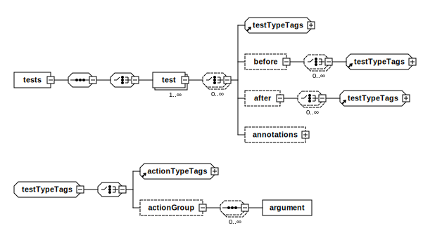

# Test cases

Test cases in the Magento Functional Testing Framework (MFTF) are defined in XML as [`<tests>`](#tests).
`<tests>` is a [Codeception test container][Codeception] that contains multiple individual tests with test metadata and before and after actions.

MFTF `<tests>` is considered a sequence of actions with associated parameters.
Any failed [assertion] within a test constitutes a failed test.

<InlineAlert variant="info" slots="text"/>

`<before>` and `<after>` hooks are not global within `<tests>`.
They only apply to the `<test>` in which they are declared.
The steps in `<after>` are run in both successful **and** failed test runs.

The following diagram shows the structure of an MFTF test case:



## Format

The format of `<tests>` is:

```xml
<?xml version="1.0" encoding="UTF-8"?>

<tests xmlns:xsi="http://www.w3.org/2001/XMLSchema-instance"
       xsi:noNamespaceSchemaLocation="urn:magento:mftf:Test/etc/testSchema.xsd">
    <test name="" insertBefore="" insertAfter="">
        <annotations>
            <!-- TEST ANNOTATIONS -->
        </annotations>
        <before>
            <!-- ACTIONS AND ACTION GROUPS PERFORMED BEFORE THE TEST -->
        </before>
        <after>
            <!-- ACTIONS AND ACTION GROUPS PERFORMED AFTER THE TEST -->
        </after>
        <!-- TEST ACTIONS, ACTION GROUPS, AND ASSERTIONS-->
    </test>
</tests>
```

## Principles

The following conventions apply to MFTF tests:

*  All names within the framework are in the CamelCase format.
*  `<test>` name must be alphanumeric.
*  Each action and action group has its own identifier `<stepKey>` for reference purposes.
*  A test may have any number of [assertions][assertion] at any point within the `<test>`.
*  If `<test>` is included in `<suite>`, it **cannot be generated in isolation** to the rest of the contents of the suite (see [suites] for details).

Multiple `<test>` tags per XML file can make it hard to find and organize tags.
To simplify, we generate one `test.php` file per `<test>` tag provided, though we support both single and multiple `<test>` tags per XML file.

## Elements reference

There are several XML elements that are used in `<tests>` in the MFTF.

### tests

`<tests>` is a container for multiple tests. It is a group of test methods that define test flows within a test case.

`<tests>` must contain at least one [`<test>`](#test).

### test

`<test>` is a set of steps, including [actions] and [assertions][assertion]. It is a sequence of test steps that define test flow within a test method.

Attribute|Type|Use|Description
---|---|---|---
`name`|string|optional|The test identifier.
`remove`|boolean|optional|Set `true` to remove the test when merging.
`insertBefore`|string|optional| This option is used for [merging]. It enables you to add all test actions contained in the original test into a test with the same name BEFORE the test step with `stepKey` that you assigned in `insertBefore`.
`insertAfter`|string|optional| Set `stepKey` of the test step after which you want to insert the test when [merging].
`deprecated`|string|optional|Used to warn about the future deprecation of the test. String will appear in Allure reports and console output at runtime.
`extends`|string|optional|A name of the parent test to [extend].

`<test>` may also contain [`<annotations>`](#annotations), [`<before>`](#before), [`<after>`](#after), any [action][actions], or [`<actionGroup>`](#actiongroup).

### annotations

[Annotations] are supported by both [Codeception] and [Allure].

Codeception annotations typically provide metadata and are able to influence test selection.
Allure annotations provide metadata for reporting.

### before

`<before>` wraps the steps to perform before the [`<test>`](#test).

`<before>` may contain these child elements:

*  Any [`<action>`][actions]
*  [`<actionGroup>`](#actiongroup)

### after

`<after>` wraps the steps to perform after the [`<test>`](#test).
The steps are run in both successful **and** failed test runs.

`<after>` may contain:

*  Any [`<action>`][actions]
*  [`<actionGroup>`](#actiongroup)

### actionGroup

`<actionGroup>` calls a corresponding [action group].

Attribute|Type|Use|Description
---|---|---|---
`ref`|string|required|References the required action group by its `name`.
`stepKey`|string|required| Identifies the element within `<test>`.
`before`|string|optional| `<stepKey>` of an action or action group that must be executed next while merging.
`after`|string|optional| `<stepKey>` of an action or action group that must be executed one step before the current one while merging.

`<actionGroup>` may contain [`<argument>`](#argument).

### argument

`<argument>` sets an argument that is used in the parent [`<actionGroup>`](#actiongroup).

Attribute|Type|Use
---|---|---
`name`|string|optional| Name of the argument.
`value`|string|optional| Value of the argument.

See [Action groups][action group] for more information.

<!-- Link definitions -->

[action group]: action-groups.md
[actions]: actions.md
[Allure]: https://github.com/allure-framework/
[Annotations]: annotations.md
[assertion]: assertions.md
[Codeception]: https://codeception.com/docs/07-AdvancedUsage
[extend]: ../extending.md
[merging]: ../merging.md#update-a-test
[suites]: ../suite.md
