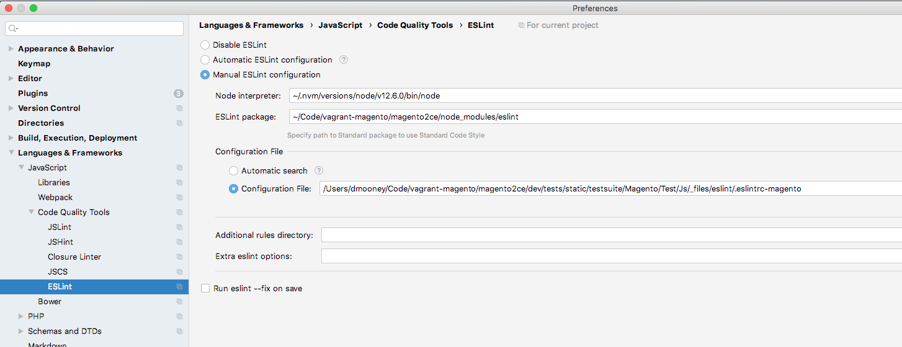
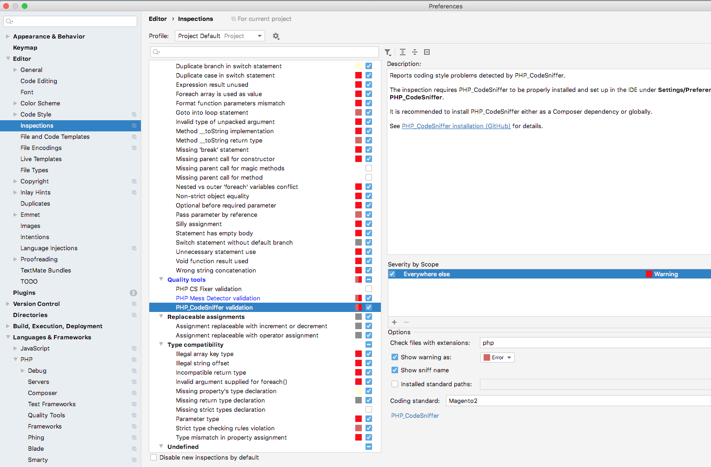
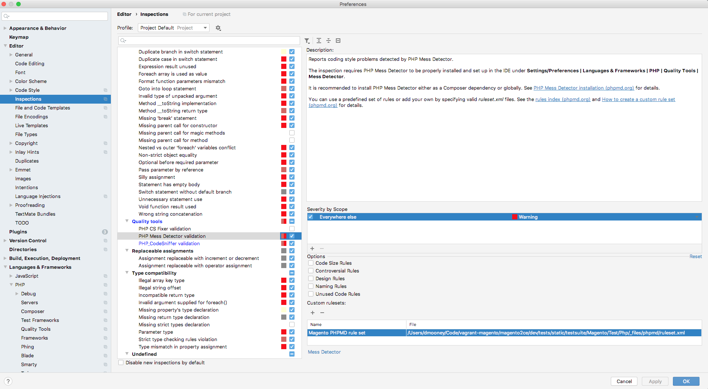

# Static analysis

This topic provides steps to set up most static analyzers that are used in our build pipeline to work in your local PHPStorm environment. This guide is written specifically for those using PHPStorm on MacOS.

## Before you begin

If you have not already, verify that `node` and `npm` are installed. Then, in the application root directory, run `npm install`.  After installation, ensure there is a `node_modules` directory in the root of your project before proceeding.

<InlineAlert variant="info" slots="text" />

For all of the static configuration installations below involving the PHPStorm Preferences dialog, make sure you are clicking the "Apply" button before clicking "OK" to close the Preferences dialog.

## Javascript Code Style check

<InlineAlert variant="warning" slots="text" />

[JSCS package has been deprecated](https://www.npmjs.com/package/jscs) and [merged with ESLint](https://eslint.org/blog/2016/04/welcoming-jscs-to-eslint).

### ESLint

<InlineAlert variant="info" slots="text" />

Javascript code analysis is done through [ESLint](https://developer.adobe.com/commerce/php/coding-standards/js/#eslint-code-analysis).
The ESLint rules are set up in `magento-coding-standard`, which is installed on Magento2 via `composer` since it's a development dependency.

1. Go to PHPStorm preferences > Languages & Frameworks > JavaScript > Code Quality Tools > ESLint.
1. Click **Manual ESLint configuration**.
1. Fill in the adjacent input fields with the path to your node binary (the result of outputting `which node` in your terminal).
1. Enter the path to your ESLint package: `[magento_root]/node_modules/eslint`
1. Click **Configuration File** and in the adjacent input field enter the path to the ESLint file the application uses, which is located in `vendor/magento/magento-coding-standard/eslint/.eslintrc-magento`.

<InlineAlert variant="info" slots="text" />

For MacOS system you may not be able to choose file with leading dot. You can rename this config file: `cp vendor/magento/magento-coding-standard/eslint/.eslintrc-magento vendor/magento/magento-coding-standard/eslint/eslintrc-magento`

See the image below for example configuration:

To verify it works, in any JS file add `/** Hello world */` as a doc comment to any method, and you should see a warning about the comment being on one line.

## PHPCS

1. Go to PHPStorm preferences > Languages & Frameworks > PHP > Quality Tools > PHP_CodeSniffer.
1. Click the `...` button to bring up another configuration modal.
1. Enter the PHP_CodeSniffer path: `[magento_root]/vendor/bin/phpcs`

### Configuring for Magento Coding Standard

1. Go to the [Magento Coding Standard GitHub Repository](https://github.com/magento/magento-coding-standard)
1. Follow instructions within the README to install the Magento Coding Standard for PHPCS.  Verify it is installed with `vendor/bin/phpcs -i`.  You should see `Magento2` in the output.
1. Go to PHPStorm preferences > Editor > Inspections, and in the adjacent window go to PHP > Quality Tools > PHP_CodeSniffer validation.
1. Under **Coding Standard** dropdown, select `Magento2`.

See the image below for example configuration:

To verify it works, add the following PHP snippet: `$base = basename($_SERVER['SCRIPT_FILENAME']);`.  You should see a warning that the use of `basename` is forbidden, as well as the use of _superglobals_.

## PHPMD

1. Go to PHPStorm preferences > Languages & Frameworks > PHP > Quality Tools > Mess Detector.
1. Click the `...` button to bring up another configuration modal.
1. Enter the PHP Mess Detector path: `[magento_root]/vendor/phpmd/phpmd/src/bin/phpmd`
1. Go to PHPStorm preferences > Editor > Inspections and in the adjacent window go to  > PHP > Quality Tools > PHP Mess Detector validation.
1. Under custom rulesets, add the path to the PHPMD ruleset the application uses: `[magento_root]/dev/tests/static/testsuite/Magento/Test/Php/_files/phpmd/ruleset.xml`

See the image below for example configuration:

To verify it works, add an unused private method to a class, and you should see a warning from PHPMD about it not being used.
