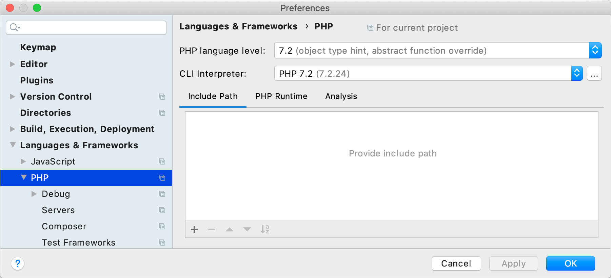
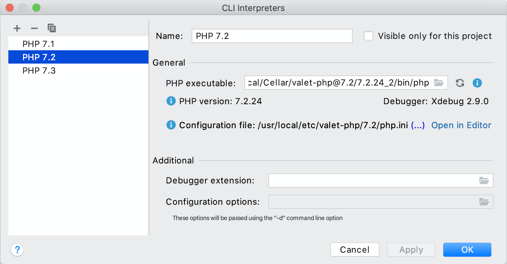
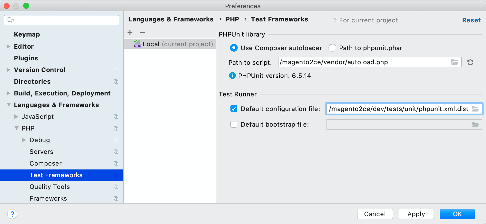
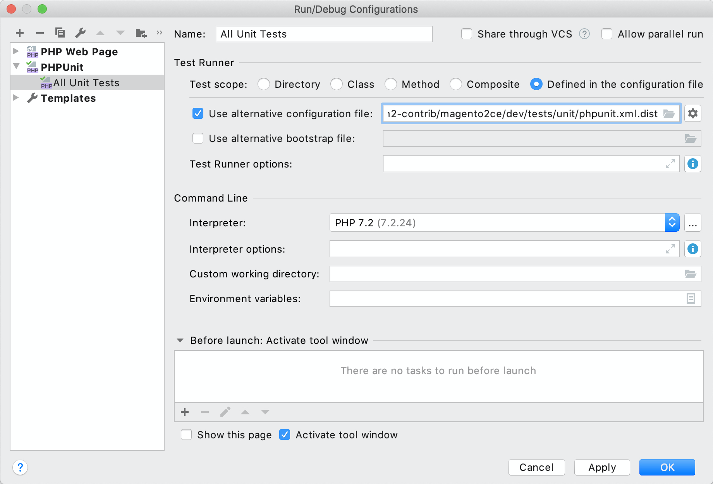
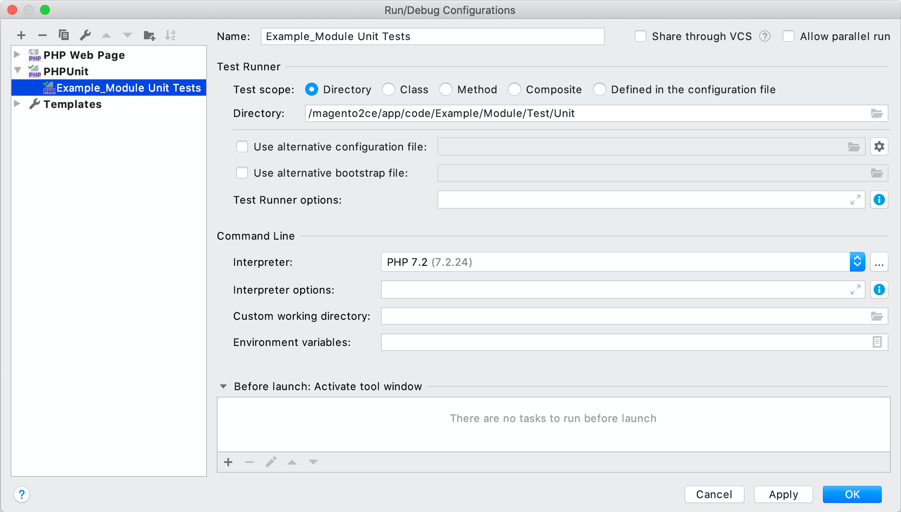
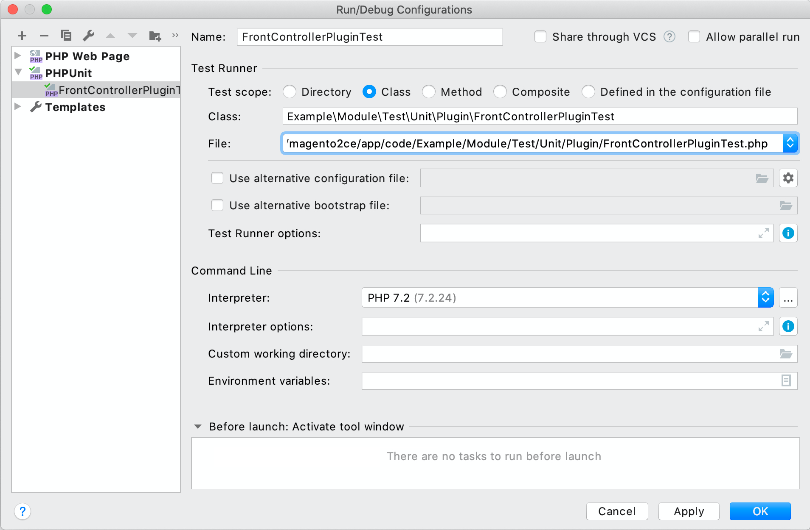

Running tests in PhpStorm requires following steps to setup the system.

1. Configuring the [PHP](https://glossary.magento.com/php) interpreter
1. Configuring PHPUnit
1. Creating a run configuration

### Configuring the PHP interpreter

In the PhpStorm preferences, select the PHP interpreter PhpStorm should use to run tests with.

If you can not select a PHP interpreter because the dropdown is empty, you can add a one by clicking on the button with the three dots beside the dropdown.

Then, click the **+** (add) button in the top right to select the desired PHP binary on your file system.

Please refer to the PhpStorm documentation for further information on [how to configure a local PHP interpreter](https://www.jetbrains.com/help/phpstorm/configuring-local-interpreter.html).

It is also possible to [configure a remote PHP interpreter](https://www.jetbrains.com/help/phpstorm/configuring-remote-interpreters.html), which is a common setup when working with Vagrant or [Docker](https://glossary.magento.com/docker) based development environments.

Please be aware that the details on configuring the PHP interpreter might vary between PhpStorm versions.

### Configuring PHPUnit

After configuring the interpreter, the next step is to set up the PHPStorm preferences for how to execute PHPUnit.

1. Click the **Use Composer autoloader** option.
1. Select the `vendor/autoload.php` file in your Magento 2 installation.
1. Optionally select the `dev/tests/unit/phpunit.xml.dist` file as the **Default configuration file**. Doing this step makes creating temporary run configurations more convenient.

Please refer to the PhpStorm documentation for further information on [Configure a test framework in a project](https://www.jetbrains.com/help/phpstorm/php-test-frameworks.html#configure_php_test_framework_in_a_project).

### Creating a run configuration

The final step is to create a *run configuration* to execute the desired tests.

There are many ways to create run configurations in PhpStorm. Here we just show one of the option.

All start by creating a new run configuration. To do so, follow these steps:

1. Select the **Run > Edit Configurations** action from the top menu.
1. Click the **+** symbol on the top right and select **PHPUnit**.

Depending on what tests should be included in the run configuration, the next steps differ.

#### Running all tests

1. Give the run configuration a descriptive name; for example **All Unit Tests**
1. Test Scope: select the **Defined in the configuration file** radio button
1. Check the **Use alternative configuration file** checkbox
1. Select the file `dev/tests/unit/phpunit.xml.dist`
1. Click **OK**.

#### Running the tests of one module

1. Give the run configuration a descriptive name; for example, **Example_Module Unit Tests**
1. Test Scope: select the **Directory** option
1. Select the directory containing the modules unit tests. PHPUnit will run every file ending with `Test.php` in the selected directory branch.
1. Click **OK**.

#### Running the tests in a class

1. Give the run configuration a descriptive name like the name of the test class; for example, **FrontControllerPluginTest**.
1. Test Scope: select the **Class** option.
1. Class: enter the fully qualified class name (including the PHP namespace).
1. File: select the file containing the test class.
1. Click **OK**.

A more convenient way to create a run configuration for a test class is to open the class in PhpStorm, and then right-clicking into the class and selecting **Create 'TestClassName'** or **Run 'TestClassName'**.

Note that the test class has to inherit from `\PHPUnit_Framework_TestCase` for PhpStorm to display that option.

### Executing the run configuration

First select the run configuration to execute in the run configuration drop-down menu above the main editor window, then click the **Play** icon beside it.

By clicking the **Debug** icon (of a bug) next to the **Play** icon, it is possible to step-debug code during test execution, if the xdebug PHP [extension](https://glossary.magento.com/extension) is installed.
